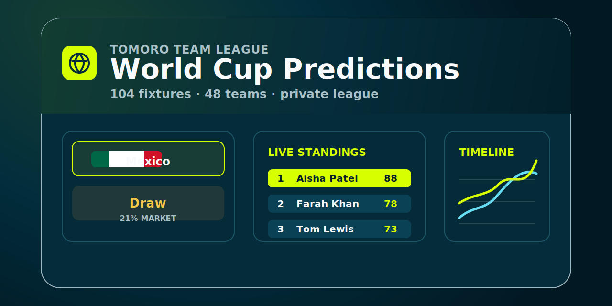

# World Cup Predictions League



A private Tomoro team game for the 2026 World Cup.

Everyone signs in with their Tomoro email, makes match predictions round by round, and watches the leaderboard change as the tournament unfolds. The experience is built to feel quick on mobile, clear on desktop, and competitive enough to keep people coming back after each set of results.

## What It Does

- Lets Tomoro teammates join with a `@tomoro.ai` email address.
- Shows World Cup fixtures as simple prediction cards.
- Splits predictions into sensible rounds, so people are not forced to predict the whole tournament at once.
- Locks each match once it kicks off.
- Keeps knockout rounds locked until the group stage is complete.
- Shows market odds when they are available, cached from The Odds API.
- Highlights whether a finished prediction was right or wrong.
- Ranks the team on a leaderboard that blends accuracy with participation.
- Includes a timeline view so you can see how people move up or down as the tournament develops.

## How People Play

1. Sign in with a Tomoro email address.
2. Pick a round.
3. Tap a team to predict they win, or tap Draw for group-stage matches.
4. Come back after matches finish to see correct and missed picks.
5. Follow the leaderboard as the league changes over time.

## Current MVP Status

The MVP is already wired around the core flow:

- Clerk sign-in is in place.
- Neon Postgres is used for persistence.
- Fixtures, teams, flags, rounds, demo users, and sample results can be seeded.
- Predictions are stored and can be edited while they are still open.
- Market odds can be pulled and saved into the database.
- Final scores can be synced automatically or recorded through a script.
- The UI is Tomoro-themed and responsive for mobile and web.

## Results And Odds

Scores and odds are stored in our own database so the app remains fast and consistent.

Market odds are pulled in batches from The Odds API and cached against matches. Because odds providers can name teams and fixtures differently, the sync script matches by date and team names where possible, then falls back to team-pair matching.

Final scores can be synced from API-Football. The safest mapping path is to sync API-Football team IDs once the 2026 World Cup season is available to the API key, then use those IDs when matching result fixtures. The free tier is limited, so the intended production pattern is deliberately quiet: schedule score pulls for the relevant match date around 30-60 minutes after full time. If the provider does not match a fixture cleanly, the manual result script remains the fallback.

Production automation uses secured Cloud Run endpoints:

- `GET /api/cron/sync-odds`
- `GET /api/cron/sync-results?date=YYYY-MM-DD`

Both endpoints require either `Authorization: Bearer $CRON_SECRET` or `x-cron-secret: $CRON_SECRET`.

## Production Notes

- Rotate any credentials that were shared during development before production.
- Keep secrets in `.env.local` locally and Cloud Run secrets in GCP.
- Use Clerk as the public auth boundary.
- Keep `@tomoro.ai` as the allowed email domain so the league can later connect cleanly to Slack.
- Schedule odds pulls carefully because the free tier has limited credits.
- Schedule score syncs more frequently on match days and less often between rounds.

## Local Setup

This section is for the person running the app locally.

```bash
pnpm install
pnpm db:push
pnpm db:seed
pnpm db:seed:demo
pnpm dev
```

Copy `.env.example` to `.env.local` and provide:

- `DATABASE_URL`
- `NEXT_PUBLIC_CLERK_PUBLISHABLE_KEY`
- `CLERK_SECRET_KEY`
- `ODDS_API_KEY`
- `ODDS_API_SPORT_KEY`
- `ODDS_API_REGIONS`
- `ODDS_API_MARKETS`
- `API_FOOTBALL_KEY`
- `API_FOOTBALL_LEAGUE_ID`
- `API_FOOTBALL_SEASON`
- `CRON_SECRET`

For local development only, `DISABLE_CLERK_LOCAL="true"` can bypass Clerk and use `LOCAL_DEV_USER_EMAIL`.

## Useful Commands

```bash
pnpm test
pnpm build
CONFIRM_PRODUCTION_RESET=true pnpm db:prepare:production
pnpm api-football:teams
pnpm odds:sync
pnpm results:sync --date 2026-06-11
pnpm results:update match-1 2 1
pnpm simulate:e2e
pnpm validate:seed
```

`pnpm simulate:e2e` creates temporary predictors and predictions, verifies knockout rounds are locked before the group stage completes, records simulated group and knockout results, checks that leaderboard accuracy/order and round history update, then removes the temporary data and restores the touched matches.

## Next Best Improvements

- Add an admin results screen instead of script-only updates.
- Add Slack reminders for upcoming round deadlines.
- Add a proper GCP Cloud Run deployment pipeline.
- Add fixture updates when FIFA publishes confirmed knockout teams.
